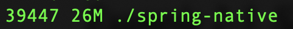

## GraalVM Native Support

This project has been configured to let you generate either a lightweight container or a native executable.
It is also possible to run your tests in a native image.

## Install GraalVM

```shell
    bash <(curl -sL https://get.graalvm.org/jdk)
```


### Executable with Native Build Tools

NOTE: GraalVM 22.3+ is required.

To create the executable, run the following goal:

```shell
$ ./gradlew nativeCompile
```

Then, you can run the app as follows:
```shell
$ build/native/nativeCompile/spring-native
```

### Lightweight Container with Cloud Native Buildpacks
If you're already familiar with Spring Boot container images support, this is the easiest way to get started.
Docker should be installed and configured on your machine prior to creating the image.

To create the image, run the following goal:

```shell
$ ./gradlew bootBuildImage
```

Then, you can run the app like any other container:

```shell
$ docker run --rm -p 8080:8080 spring-native:0.0.1-SNAPSHOT
```

You can also run your existing tests suite in a native image.
This is an efficient way to validate the compatibility of your application.

To run your existing tests in a native image, run the following goal:

```shell
$ ./gradlew nativeTest
```

Check the resources

```shell
 $ ps -o pid,rss,command -p <process_id> | awk '{$2=int($2/1024)"M";}{print;}'
```
| Process Id | RAM  | Command |
